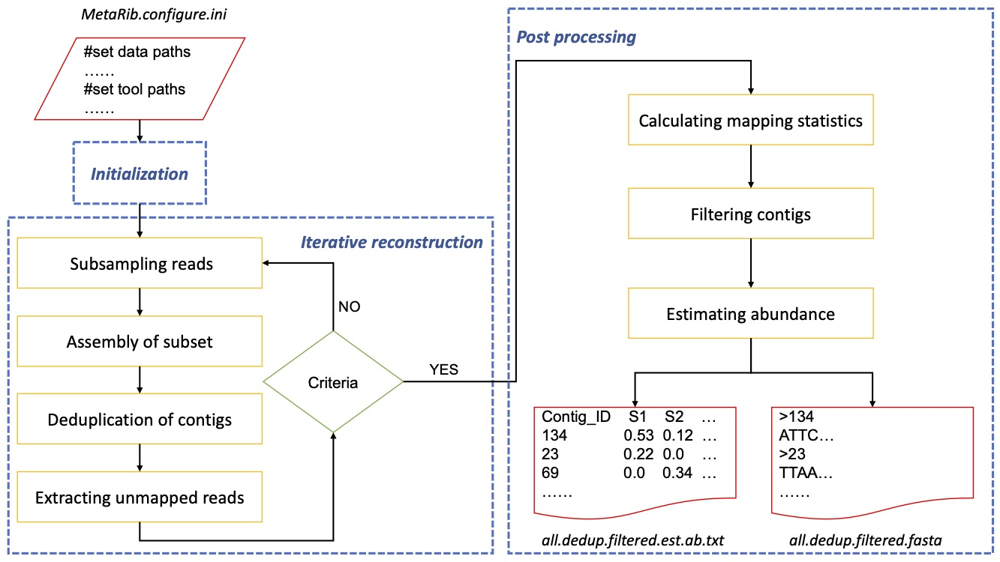

## Introduction 
MeteRib is an iterative tool for ribosomal gene reconstruction from whole RNA meta-transcriptomic data. “Total RNA metatranscriptomics” enables us to investigate structural (rRNA) and functional (mRNA) information from samples simultaneously without any PCR or cloning step. Many bioinformatic tools have developed for mRNA analysis in metatranscriptomics, however, no such available tools for rRNA reconstruction in total RNA metatranscriptomics due to the massive and complex rRNA information from such datasets.  MetaRib is based on the most commonly used rRNA assembly tool EMIRGE with several improvements to circumvent these hurdles. 

Some of highlights in our method include the following:
* We utilize the uneven distribution of microbial communities that reconstruct highly abundant rRNA genes firstly using smaller * subset in an iterative approach.      
* We boost the whole process for large scale rRNA dataset with strict alignment.   
* We address over-estimation issue of EMIRGE and achieve full-length rRNA reconstruction by dereplicating and clustering contigs in each iteration.    
* We further estimate the relative abundance of reconstructed rRNA genes among samples and filter potential false-positive records using mapping statistics information.     


The MetaRib workflow consists of three major modules: i) initialization, ii) iterative reconstruction and iii) Post processing. Schematic overview of MetaRib workflow is shown below:    
  


         
## Dependencies            
* EMIRGE: https://github.com/csmiller/EMIRGE
* BBtools: https://jgi.doe.gov/data-and-tools/bbtools/  
* Python: python2.7, pandas.   


## Usage    

Assume your current folder is: */project*. Then the following setup would be appropriate to run MetaRib.    

***Step1: Data preparation.***       
MetaRib supports multiple samples. If you data folder is: */project/data*, merge all samples reads to generate all.1.fq and all.2.fq (cat SAMPLE*.1.fq > all.1.fq, cat SAMPLE*.2.fq > all.2.fq), your data folder structure need be like this:    

\________________________________   
Content of *samples.list.txt* files:    
*SAMPLE_1*   
*SAMPLE_2*   
\________________________________    
Data folder files:  
*/project/data/samples.list.txt*   
*/project/data/SAMPLE_1.1.fq*      
*/project/data/SAMPLE_1.2.fq*          
*/project/data/SAMPLE_2.1.fq*         
*/project/data/SAMPLE_2.2.fq*             
*/project/data/all.1.fq*   
*/project/data/all.2.fq*     

***Step2: Setup configure file.***       
Content of *MetaRib.cfg* need to have the folowing information:   
```
[BASE]    
# your project folder       
PROJECT_DIR : /project/   
# your data folder        
DATA_DIR : /project/data/        
# Subsampling reads number in each iteration        
SAMPLING_NUM : 100000     
# Number of cores used in MetaRib     
THREAD : 20   

[EMIRGE]     
# EMIRGE path       
EM_PATH : ~/bin/EMIRGE/emirge_amplicon.py  
# EMIRGE parameters   
EM_PARA : --phred33 -l 125 -i 250 -s 50 -a 20 -n 20  
# EMIRGE references   
EM_REF : ~/bin/EMIRGE/references/silva.v123.fa  
# EMIRGE reference index   
EM_BT : ~/bin/EMIRGE/references/silva.v123.fa.btindex   

[BBTOOL]   
# BBTOOLS path   
BB_PATH: ~/bin/BBTOOL/   
# BBTOOLS mapping parameters   
MAP_PARA : minid=0.96 maxindel=1 minhits=2 idfilter=0.98   
# BBTOOLS cluster parameters   
CLS_PARA : fo=t ow=t c=t mcs=1 e=5 mid=99   

[FILTER]    
# Minimium averge coverage in filter process    
MIN_COV : 2   
# Minimium coverge percent in filter process   
MIN_PER : 80    
```

***Step3: Run MetaRib.***  
MetaRib is developed in Python2.7 as EMIRGE is impletmented in Python2.7. After you prepare the data and configure file, run the code like this:    
```python
python2 run_MetaRib.py -cfg MetaRib.cfg
```
MetaRib will also output information about remaining unmapped reads and novel contigs at each iteration. A demo is shown below:   
```
====START ITERATION 1====
Iteration: 1    Total contigs: 981      New contigs: 981        unmapped fastq (MB): 61.92
====FINISH ITERATION 1====
====START ITERATION 2====
Iteration: 2    Total contigs: 1418     New contigs: 437        unmapped fastq (MB): 38.17
====FINISH ITERATION 2====
====START ITERATION 3====
Iteration: 3    Total contigs: 1439     New contigs: 21 unmapped fastq (MB): 36.15
====FINISH ITERATION 3====
====START ITERATION 4====
Iteration: 4    Total contigs: 1455     New contigs: 16 unmapped fastq (MB): 35.83
====FINISH ITERATION 4====
====START LAST ITERATION 5====
Iteration: 5    Total contigs: 1463     New contigs: 8
====FINISH ITERATION 5====
====START POSTPROCESSING====
Raw contig:1463 Filtered contigs: 855
====FINISH POSTPROCESSING====
====PROGRAM FINISHED!====
```

***Step4: Output.***       
All output will be stored at */project/MetaRib/*.    
*/project/MetaRib/Iteration/* stores all intermediate data of each iteration.   

*/project/MetaRib/Abundance/* stores all information related with post-processing and final result.

There are three final output files: 

* *all.dedup.fasta* is the original reconstructed fasta without post-processing filtering  
* *all.dedup.filtered.fasta* is the filtered reconstructed fasta after post-processing filtering
* *all.dedup.filtered.est.ab.txt* is the estimated relative abundance table for filtered fasta 


